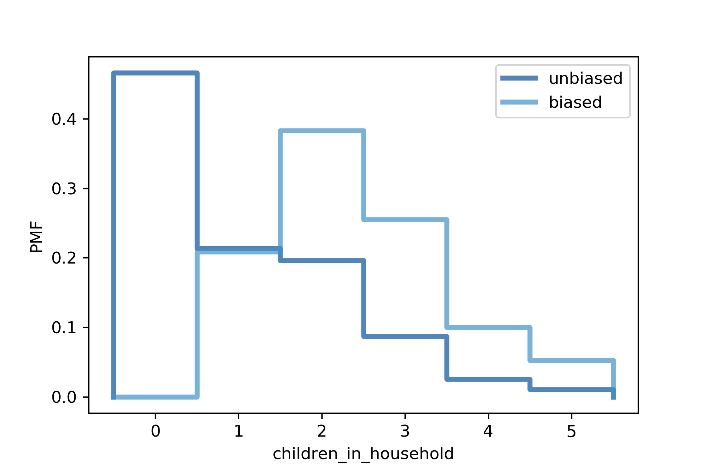

[Think Stats Chapter 3 Exercise 1](http://greenteapress.com/thinkstats2/html/thinkstats2004.html#toc31) (actual vs. biased)

## Import Libraries

```python
import numpy as np
import nsfg
import thinkstats2
import thinkplot
```

## Define PMF Biasing Function

```python
def BiasPmf(pmf, label):
    new_pmf = pmf.Copy(label=label)

    for x, p in pmf.Items():
        new_pmf.Mult(x, x)
        
    new_pmf.Normalize()
    return new_pmf
```

## Create PMFs and Plot

```python
resp = nsfg.ReadFemResp()

unbiased_pmf = thinkstats2.Pmf(resp['numkdhh'], label='unbiased')

biased_pmf = BiasPmf(unbiased_pmf, label='biased')

thinkplot.PrePlot(2)
thinkplot.Pmfs([unbiased_pmf, biased_pmf])
thinkplot.Config(xlabel='children_in_household', ylabel='PMF')
```

[Output]



## Print Unbiased and Biased Mean

```python
print(unbiased_pmf.Mean(), biased_pmf.Mean())
```

[Output] 1.024205155043831 2.403679100664282

Here we can see that the biased mean is much larger than the unbiased mean.
