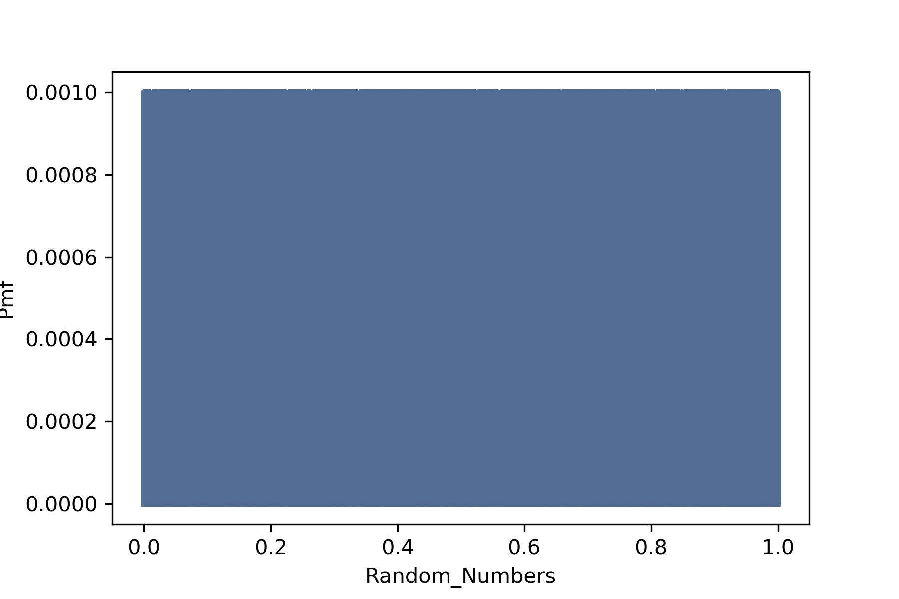
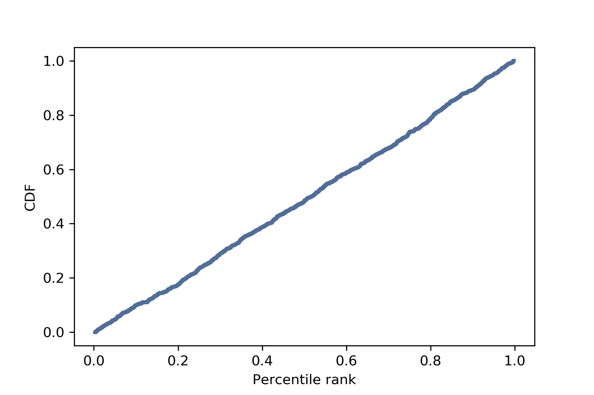

[Think Stats Chapter 4 Exercise 2](http://greenteapress.com/thinkstats2/html/thinkstats2005.html#toc41) (a random distribution)

## Import Libraries 

```python
import numpy as np
import thinkstats2
import thinkplot
```

## Generate Random Numbers and Plot PMF

```python
rands = np.random.random(1000)

rands_pmf = thinkstats2.Pmf(rands)

thinkplot.Pmf(rands_pmf)
thinkplot.Config(xlabel='Random_Numbers', ylabel='Pmf')
```

[Output]



This plot doesn't tell us much about the distribution of random numbers. Each number appears only once and therefor the PMF is capped at 0.001. Essentailly this just shows compressed random noise. Let's plot the CDF instead!

## Plot CDF

```python
rands_cdf = thinkstats2.Cdf(rands)
thinkplot.Cdf(rands_cdf)
thinkplot.Config(xlabel='Percentile rank', ylabel='CDF')
```

[Output]



Here we can see that distribution of random numbers is in fact uniform.
