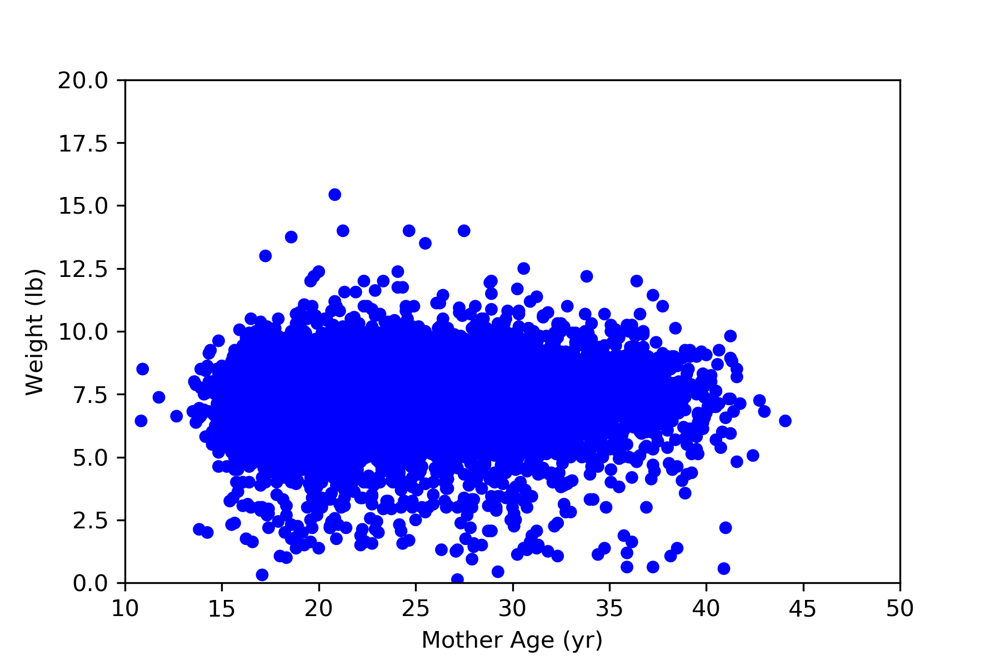

[Think Stats Chapter 7 Exercise 1](http://greenteapress.com/thinkstats2/html/thinkstats2008.html#toc70) (weight vs. age)

Using data from the NSFG, make a scatter plot of birth weight versus mother’s age. Plot percentiles of birth weight versus mother’s age. Compute Pearson’s and Spearman’s correlations. How would you characterize the relationship between these variables?

## Solution

First import the necessary libraries and data

```python
import thinkstats2
import thinkplot
import numpy as np
import pandas as pd
import first

live, firsts, others = first.MakeFrames()
live = live.dropna(subset=['agepreg', 'totalwgt_lb'])
```

Define the functions for Covariance, Pearson Correlation, and Spearman Correlation

```python
def Cov(xs, ys, meanx=None, meany=None):
    xs = np.asarray(xs)
    ys = np.asarray(ys)

    if meanx is None:
        meanx = np.mean(xs)
    if meany is None:
        meany = np.mean(ys)

    cov = np.dot(xs-meanx, ys-meany) / len(xs)
    return cov

def Corr(xs, ys):
    xs = np.asarray(xs)
    ys = np.asarray(ys)

    meanx, varx = thinkstats2.MeanVar(xs)
    meany, vary = thinkstats2.MeanVar(ys)

    corr = Cov(xs, ys, meanx, meany) / np.sqrt(varx * vary)
    return corr

def SpearmanCorr(xs, ys):
    xranks = pd.Series(xs).rank()
    yranks = pd.Series(ys).rank()
    return Corr(xranks, yranks)
```

## Scatter Plot

```python
thinkplot.Scatter(live['agepreg'], live['totalwgt_lb'], alpha=1)
thinkplot.Config(xlabel='Mother Age (yr)',
                 ylabel='Weight (lb)',
                 axis=[10, 50, 0, 20],
                 legend=False)
```



## Percentiles Plot

First create bins for mother's age. Then find CDF distributions of baby weight for each bin. Finally, determine 25th, 50th, and 75th percentile weight for each bin and plot

```python
bins = np.arange(15, 42, 3)
indices = np.digitize(live['agepreg'], bins)
groups = live.groupby(indices)

mean_ages = [group.agepreg.mean() for i, group in groups]
cdfs = [thinkstats2.Cdf(group.totalwgt_lb) for i, group in groups]

for percent in [75, 50, 25]:
    weight_percentiles = [cdf.Percentile(percent) for cdf in cdfs]
    label = '%dth' % percent
    thinkplot.Plot(mean_ages, weight_percentiles, label=label)
    
thinkplot.Config(xlabel='Age (yr)',
                 ylabel='Weight (lb)',
                 axis=[10, 50, 0, 20],
                 legend=False)
```


## Correlation

Use functions defined above to determine the Pearson and Spearman correlation between mother's age and baby weight

```python
pearson = round(Corr(live['agepreg'],live['totalwgt_lb']),3)
spearman = round(SpearmanCorr(live['agepreg'],live['totalwgt_lb']),3)

print("Pearson: %s \nSpearman: %s" % (pearson, spearman))
```

[Output]:

```
Pearson: 0.069 
Spearman: 0.095
```

Both the Pearson and Spearman correlation coefficients show a weak positive correlation between mother's age and birth weight. There is not nearly enough evidence here to determine a causal relationship between the variables. The relationship between the variables appears to be on the spectrum between weak to non-existent.
