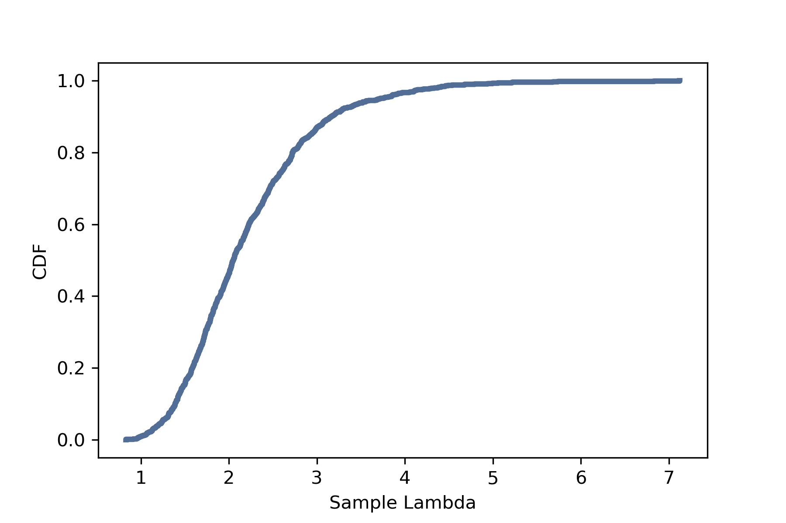
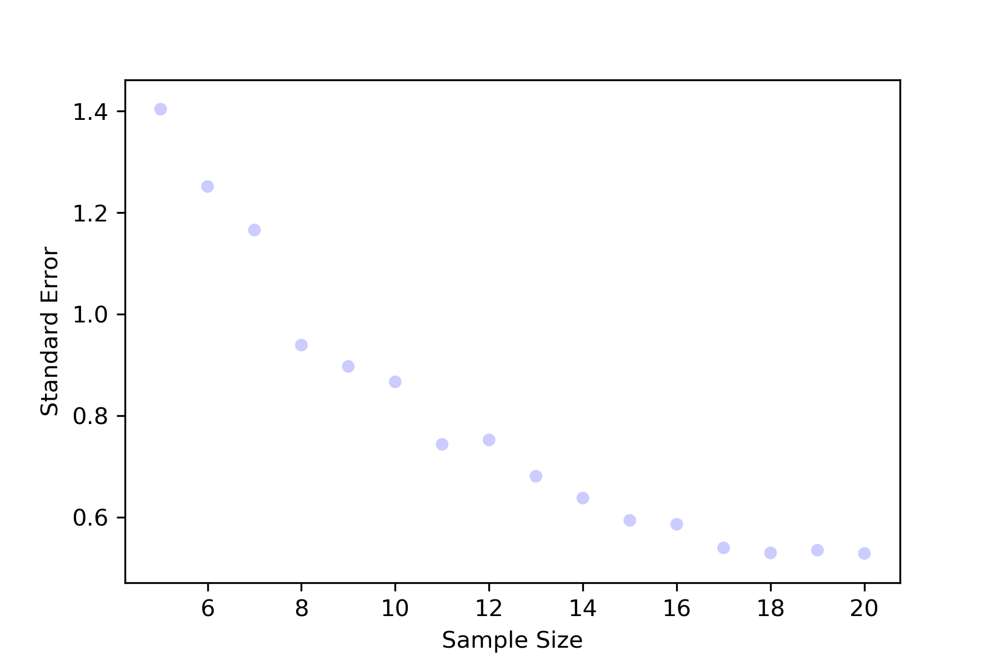

[Think Stats Chapter 8 Exercise 2](http://greenteapress.com/thinkstats2/html/thinkstats2009.html#toc77) (scoring)

Exercise: Suppose you draw a sample with size n=10 from an exponential distribution with λ=2. Simulate this experiment 1000 times and plot the sampling distribution of the estimate L. Compute the standard error of the estimate and the 90% confidence interval.

Repeat the experiment with a few different values of n and make a plot of standard error versus n.

## Solution

First we need to import libraries and define functions

```python
import thinkstats2
import thinkplot
import numpy as np
import random

def RMSE(estimates, actual):
    """Computes the root mean squared error of a sequence of estimates.

    estimate: sequence of numbers
    actual: actual value

    returns: float RMSE
    """
    e2 = [(estimate-actual)**2 for estimate in estimates]
    mse = np.mean(e2)
    return np.sqrt(mse)

def Estimate4(n, iters=1000):
    lam = 2

    means = []
    medians = []
    for _ in range(iters):
        xs = np.random.exponential(1.0/lam, n)
        L = 1 / np.mean(xs)
        means.append(L)
    std_err = RMSE(means, lam)
    
    return means, std_err
```

Create a sampling distribution for lambda by using the Estimate4 function

```python
ls, rmse = Estimate4(10)

cdf = thinkstats2.Cdf(ls)
thinkplot.Cdf(cdf)
thinkplot.Config(xlabel='Sample Lambda',
                 ylabel='CDF')
```




We already have the standard error of this distribution from Estimate4. We can use the Cdf.Percentile() method to also determine the 90% confidence interval.

```python
rmse = round(rmse, 3)
conf_int = (round(cdf.Percentile(5),3), round(cdf.Percentile(95),3))

results = "RMSE: " + str(rmse) + "\n90% Confidence Interval: " + str(conf_int)
print(results)
```

[Output]:

```
RMSE: 0.833
90% Confidence Interval: (1.273, 3.774)
```

Finally, we can iterate the Estimate4 function with various values of n and store the standard error for each n in a list. This list can then be used to plot standard error vs n.

```python
RMSEs = []

for i in range(5,21):
    ls, rmse = Estimate4(i)
    RMSEs.append(rmse)

thinkplot.Scatter(range(5,21), RMSEs)
thinkplot.Config(xlabel='Sample Size',
                 ylabel='Standard Error')
```


